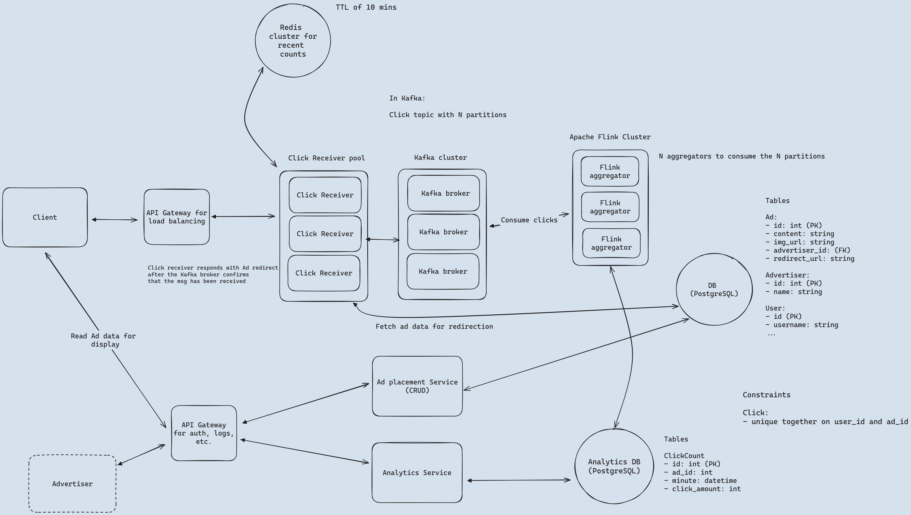

# Ad Click Aggregator (demo)

An ad click aggregator built end to end on a local multi-zone Kubernetes cluster. Every click is
redirected in milliseconds, counted exactly once per minute by a Flink pipeline, and queryable by
advertisers. Then it's broken on purpose (zone loss, broker/DB/Redis kills, drift) to show it holds.

[](design/diagram.png)

*The design as drawn (click for the full board with requirements). What was built, with replica
counts: [`design/RESULTS.md`](design/RESULTS.md#what-was-built).*

- **Stack:** kind (5 nodes, 3 zones) · Flux (GitOps from an OCI artifact) · every component from
  pinned Artifact Hub charts: CloudNativePG, Strimzi Kafka, Redis Cluster, Flink operator, Floci (S3)
  · Envoy Gateway · FastAPI services · Next.js client · k6-operator · Chaos Mesh · Prometheus/Grafana.
- **Click path:** ad lookup (cache → read replica → primary) → dedup in Redis (fails open) → salted
  key for hot ads → Kafka `acks=all`, waiting for the ack (1 s deadline, load shedding) → 302.

## Run it

```bash
make doctor          # read-only check: tools, Docker, kernel limits (installs nothing)
make up              # kind cluster + Flux; Flux installs platform, components, design (~9 min cold)
make ci              # Tilt: build + deploy services, pipeline, client; run the e2e tests
make load S=clicks   # in-cluster k6 + aggregated gates + reconcile
make chaos E=<name>  # see chaos/README.md
make down
```

App <http://localhost:8080> · Flux UI `flux.localhost:8080` · Kafka UI `kafka-ui.localhost:8080` ·
Grafana `grafana.localhost:8080` (admin/admin) · Prometheus `prometheus.localhost:8080` · Chaos Mesh
`chaos.localhost:8080`.

Tools you need (the lab never installs them): docker, kind, kubectl, helm, ctlptl, tilt, uv, node,
pnpm, python3. To use kubectl/helm against the lab from your shell: `source scripts/env.sh`
(kubeconfig and helm state live in the repo, your `~/.kube/config` is untouched).

## Results (highlights)

| Check | Result |
| ----- | ------ |
| Acceptance flows | e2e **27/27** through the gateway |
| Load, 500 rps + 1,000 rps burst (in-cluster k6, 3 zones) | p95 **11.9 ms** steady / **16.9 ms** burst, 0 % errors, counts reconcile **exactly** |
| Zone-b node down | **99.976 %** of clicks OK, ~15 s error window, lost = 0 |
| All 6 Redis pods killed under load | **0 click errors**, cluster re-forms by itself |
| Kafka broker / Flink TaskManager / DB primary kills | ≤ 0.01 % errors, lost = 0 |
| Drift (delete a Flux-managed Secret + Deployment) | restored by Flux within seconds |

Full numbers, findings and trade-offs: [`design/RESULTS.md`](design/RESULTS.md). Spec and contracts:
[`design/spec.md`](design/spec.md), [`design/contracts/`](design/contracts/); Excalidraw source of
the diagram: [`design/diagram.excalidraw`](design/diagram.excalidraw).

Built on [system-design-lab](https://github.com/pablogadhi/system-design-lab); the rest of this
README describes that lab.

## The lab it's built on

Build system designs end to end on a local multi-node Kubernetes cluster, then break them on purpose.
Draw a design in Excalidraw, hand it to Claude Code, and get working infra + services + a demo client,
verified by e2e tests, load tests and chaos experiments.

```
                    http://localhost:8080
                           │
                ┌──────────▼──────────┐   kind cluster "sdl": 1 control plane + 4 workers
                │ Envoy Gateway (API  │   zone-a: worker, worker4 · zone-b: worker2 · zone-c: worker3
                │ gateway, NodePort)  │
                └───┬────────────┬────┘
        /api/<svc>/…│            │ /
            ┌───────▼───┐   ┌────▼────┐     ns apps: services + client (generic chart, spread over zones)
            │ services  │   │ client  │
            └───────┬───┘   └─────────┘
                    │ <component>-conn secrets
            ┌───────▼─────────────────────┐   ns data: components (postgres, kafka, redis, …)
            │ components (operators)      │
            └─────────────────────────────┘
  platform: cert-manager · metrics-server · Prometheus + Grafana · Chaos Mesh · local registry :5005
```

### Building a design

```bash
# 1. In Excalidraw: File → Save to… (.excalidraw) and Export image (.png)
make new-design N=ad-aggregator ARGS="--diagram ~/Downloads/ad.excalidraw --png ~/Downloads/ad.png"
cd ../ad-aggregator && claude
> /build-design
```

`/build-design` runs this flow (details in `.claude/skills/build-design/SKILL.md`):

1. **Architect** (main session, with you): parses the diagram, writes `design/spec.md` + contracts
   (OpenAPI, event schemas, DB schemas, config matrix) and `stack.yaml`. **You approve the spec.**
2. **Builders in parallel** (subagents, each owning its folders):
   `infra-builder` (components + design infra), `services-builder` (FastAPI services, pipelines),
   `client-builder` (Next.js flows).
3. **Integrator** brings everything up, runs smoke/e2e/load/chaos, fixes wiring or reports defects
   back to the owning builder until green.
4. **Results** in `design/RESULTS.md`; new components are proposed for harvesting back into the template.

### Components: built on demand, harvested back

Components are Flux bases over existing Artifact Hub charts, built the first time a design needs
them, following `infra/components/AUTHORING.md` and the researched approaches in
`infra/components/PLAYBOOK.md`. Then `make harvest C=kafka` pushes one to the template as branch
`component/kafka`; merge it there and every later design reuses it.

### Layout

See `CLAUDE.md` for the full ownership map and conventions.

```
design/      input diagram + spec + contracts        infra/cluster/     kind + registry (ctlptl)
services/    FastAPI uv workspace (+ sdl_common)     infra/flux/        Flux bootstrap + platform
pipelines/   stream jobs (Flink)                     infra/components/  reusable backing infra
client/      Next.js demo                            infra/design/      design-specific infra
tests/e2e/   acceptance flows                        infra/charts/app/  generic workload chart
loadtest/    k6 scripts          chaos/  experiments  scripts/          lab tooling
```

## License

[MIT](LICENSE)
